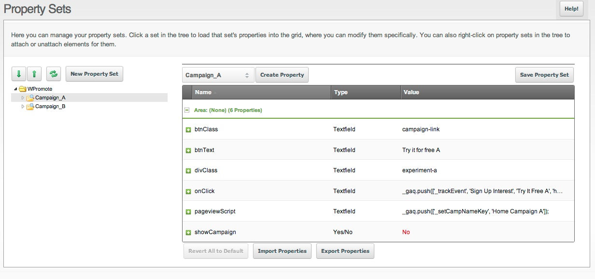

MODX-ab-process
===============

##MODX Simple A/B Process##

> This tutorial will outline a custom A/B scenario using Property Sets, some simple PHP, and jQuery HTML edits. 

- - -

##Property Sets##

If your not familiar with [MODX Property Sets](http://rtfm.modx.com/revolution/2.x/making-sites-with-modx/customizing-content/properties-and-property-sets), you might want to start there just setting up your values.

- - -

##Chunk##

**Use the chunk in this repo as a guide to setup your template.**

The example is a jQuery chunk included at the bottom of our template. 

- It first checks, via [MODX If](http://rtfm.modx.com/extras/revo/if) if you want to show this campaign.
- Next, we write a simple link with Google Analytics Scripts. This link has CSS that makes it look like a button. 
- Set DIV's with this class to show, more on this later.
- Finally, we render the Google Analytics Campaign/Pageview Script. 

- - -

##SNIPPET##

**Use the snippet in this folder as a guide to setup your experiment scenario. It should be called in the very BOTTOM of your template.**

    [[!experiment-control]]

Since we are doing a 50/50 experiment lets use a simple even/odd scenario. If the minute is even **do** else **do this**

There are 3 variables to check in our provided example:

- Chunk Name
- 2 Campaign Names that must match your Property Sets

- - -

##HTML##

Our tutorial uses the following element where we want our links to render:

    

In your CSS set:

    .experiment-element{display: none;}

